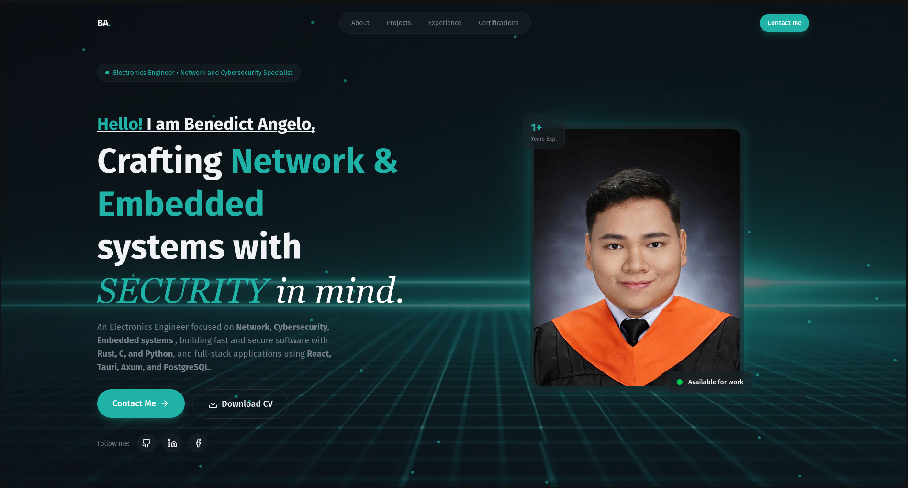
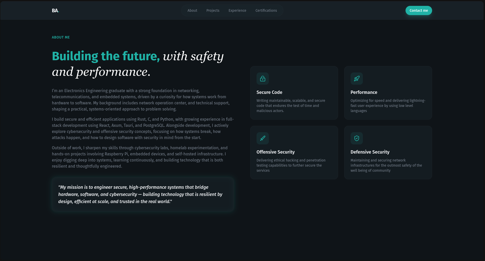
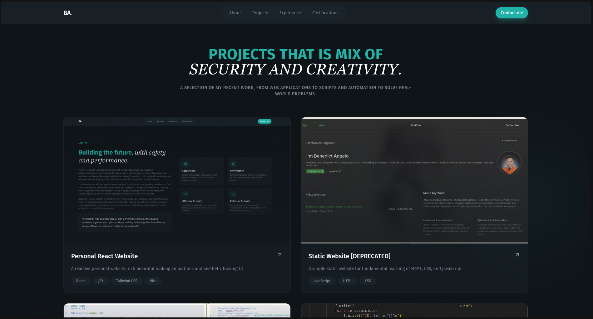
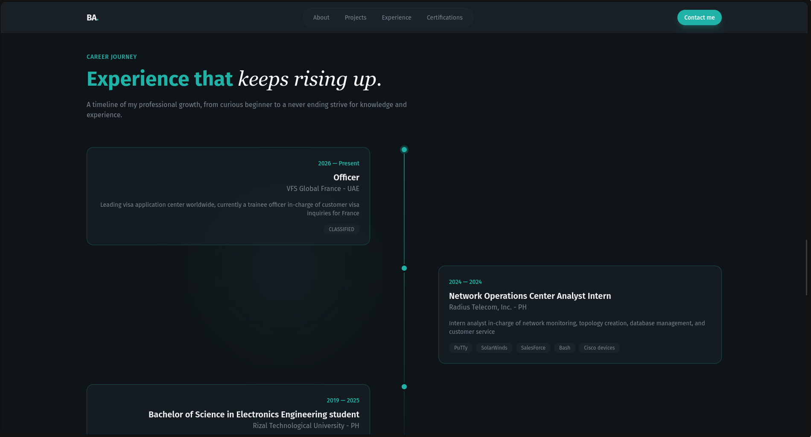
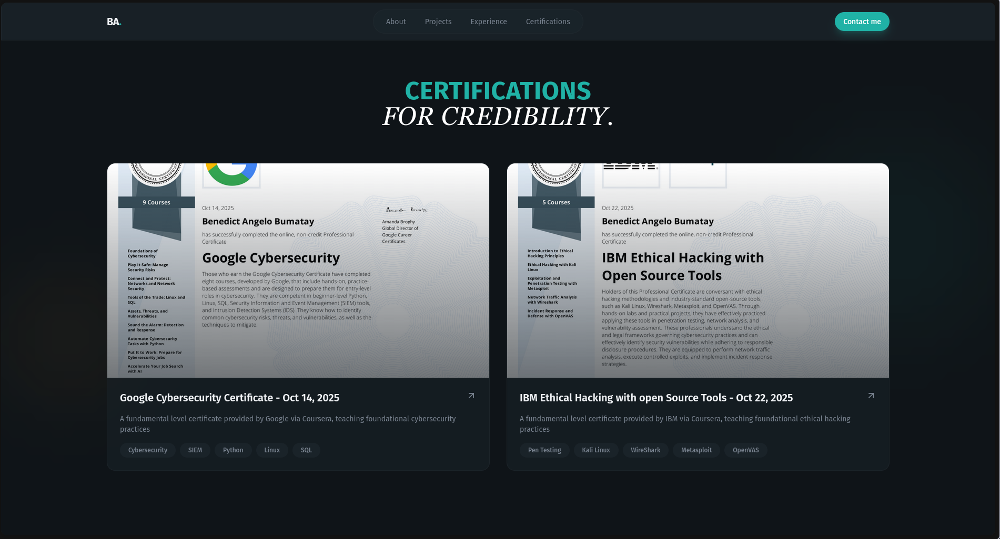
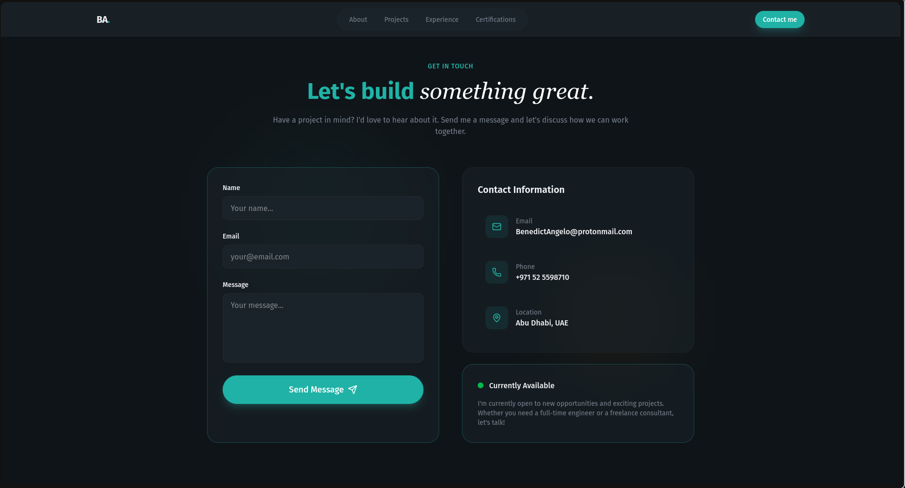
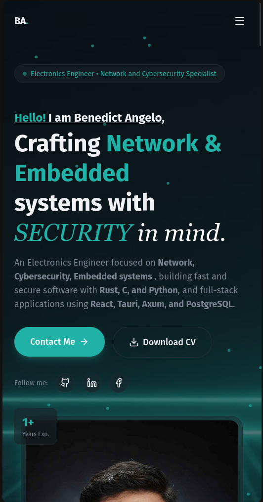

# Benedict Angelo's Portfolio Website

A modern, responsive portfolio website built with React, Vite, and Tailwind CSS. This project showcases my work as an Electronics Engineer specializing in Network, Cybersecurity, and Embedded Systems development.

## 🌟 Features

- **Modern Design**: Beautiful glassmorphic UI with smooth animations and gradient effects
- **Fully Responsive**: Optimized for desktop, tablet, and mobile devices
- **Performance Optimized**: Built with Vite for lightning-fast load times
- **Accessibility**: Semantic HTML and keyboard navigation support
- **Contact Form**: Integrated EmailJS for direct communication
- **Project Showcase**: Display of featured projects with live links and GitHub repositories
- **Smooth Animations**: Fade-in effects, floating elements, and interactive hover states
- **Dark Theme**: Eye-friendly dark color scheme with teal accent colors

## 🛠️ Tech Stack

### Frontend
- **React** 19.2.0 - UI library
- **Vite** 7.3.1 - Build tool and dev server
- **Tailwind CSS** 4.2.1 - Utility-first CSS framework
- **Lucide React** 0.575.0 - Icon library

### Backend Integration
- **EmailJS** 4.4.1 - Email service integration

### Development Tools
- **ESLint** 9.39.1 - Code linting
- **Vite React SWC Plugin** 4.2.2 - Fast React compilation
- **gh-pages** 6.3.0 - GitHub Pages deployment

## 📁 Project Structure

```
react-website-portfolio/
├── src/
│   ├── components/
│   │   ├── Button.jsx              # Reusable button component
│   │   └── AnimatedBorderButton.jsx # Button with animated border effect
│   ├── layout/
│   │   └── Navbar.jsx              # Navigation bar with mobile menu
│   ├── sections/
│   │   ├── Hero.jsx                # Hero section with intro and skills
│   │   ├── About.jsx               # About section with highlights
│   │   ├── Projects.jsx            # Projects showcase grid
│   │   ├── Experience.jsx          # Experience timeline
│   │   ├── Certifications.jsx      # Certifications display
│   │   └── Contact.jsx             # Contact form and information
│   ├── assets/                     # Static assets (CV, etc.)
│   ├── App.jsx                     # Main App component
│   ├── main.jsx                    # React entry point
│   └── index.css                   # Global styles
├── public/
│   ├── profile-photo.jpg           # Profile picture
│   ├── hero-bg.jpg                 # Hero section background
│   ├── ba-icon.png                 # Favicon
│   ├── certificates/               # Certificate images
│   └── projects/                   # Project thumbnail images
├── package.json                    # Dependencies and scripts
├── vite.config.js                  # Vite configuration
├── eslint.config.js                # ESLint configuration
└── index.html                      # HTML entry point
```

## 📋 Sections Overview

### Hero Section
- Dynamic introduction with animated background
- Floating animated dots for visual interest
- Skills marquee showcase with auto-scrolling
- Call-to-action buttons (Contact & Download CV)
- Social media links (GitHub, LinkedIn, Facebook)
- Available for work badge

### About Section
- Professional bio and background
- Four highlight cards showcasing specialties:
  - Secure Code
  - Performance Optimization
  - Offensive Security
  - Defensive Security
- Personal mission statement in a glassmorphic card

### Projects Section
- Grid layout displaying featured projects
- Project cards with:
  - Thumbnail images
  - Project title and description
  - Technology tags
  - Live link and GitHub repository buttons
- "View All Projects" call-to-action

### Experience Section
- Professional experience timeline
- Roles, companies, and responsibilities

### Certifications Section
- Certification display with images
- Organized by category or date

### Contact Section
- Contact form with validation
- Contact information (Email, Phone, Location)
- Availability status indicator
- Success/error message feedback

## 🚀 Getting Started

### Prerequisites
- Node.js (v16 or higher)
- npm or yarn

### Installation

1. Clone the repository:
```bash
git clone https://github.com/BenedictAngelo/react-website-portfolio.git
cd react-website-portfolio
```

2. Install dependencies:
```bash
npm install
```

3. Set up environment variables:
Create a `.env` file in the root directory with the following variables:
```
VITE_EMAILJS_SERVICE_ID=your_service_id
VITE_EMAILJS_TEMPLATE_ID=your_template_id
VITE_EMAILJS_PUBLIC_KEY=your_public_key
```

### Development

Start the development server:
```bash
npm run dev
```

The application will be available at `http://localhost:5173`

### Build

Build for production:
```bash
npm run build
```

### Preview

Preview the production build:
```bash
npm run preview
```

### Linting

Run ESLint to check for code issues:
```bash
npm run lint
```

## 📦 Deployment

### GitHub Pages

Deploy to GitHub Pages:
```bash
npm run deploy
```

This command builds the project and pushes the `dist` folder to the `gh-pages` branch.

### Other Platforms

The project can be deployed to any static hosting service:
- **Vercel** - Connect GitHub repository for automatic deployments
- **Netlify** - Drag and drop or connect GitHub repository
- **AWS S3 + CloudFront** - Manual deployment via CLI

## 🎨 Customization

### Colors and Theme

Edit `src/index.css` to modify the color scheme. The main colors used are:
- **Primary (Teal)**: `#20B2A6`
- **Background**: Dark theme colors
- **Accent**: Highlight colors for CTAs

### Content

Update section content in their respective files:
- Hero intro: `src/sections/Hero.jsx`
- About bio: `src/sections/About.jsx`
- Projects data: `src/sections/Projects.jsx`
- Contact info: `src/sections/Contact.jsx`

### Assets

Replace images in the `public/` directory:
- `profile-photo.jpg` - Your profile picture
- `hero-bg.jpg` - Hero section background
- `ba-icon.png` - Favicon
- `projects/*.png` - Project thumbnails
- `certificates/*.png` - Certification images

## 📸 Screenshots

### Homepage/Hero Section

*The main landing page featuring an animated hero section with profile information and call-to-action buttons*

### About Section

*About section showcasing professional background and key specialties*

### Projects Showcase

*Grid of featured projects with descriptions and technology stack*

### Experience Timeline

*Professional experience and career milestones*

### Certifications

*Certifications and credentials display*

### Contact Form

*Contact form and contact information section*

### Mobile View


*Responsive design on mobile devices*

## 🔧 Environment Variables

The project requires EmailJS credentials to enable the contact form:

| Variable | Description |
|----------|-------------|
| `VITE_EMAILJS_SERVICE_ID` | Your EmailJS service ID |
| `VITE_EMAILJS_TEMPLATE_ID` | Your EmailJS template ID |
| `VITE_EMAILJS_PUBLIC_KEY` | Your EmailJS public key |

Get these from [EmailJS Dashboard](https://dashboard.emailjs.com/)

## 📚 Key Features Explanation

### Glassmorphic Design
The portfolio uses a glassmorphic design pattern with:
- Semi-transparent backgrounds (`.glass` class)
- Backdrop blur effects
- Layered depth for visual hierarchy

### Animation System
- **Fade-in animations**: Staggered entrance effects with CSS delays
- **Marquee animation**: Continuous scrolling skills section
- **Hover effects**: Interactive elements respond to user interaction
- **Float animation**: Subtle floating motion on badges

### Responsive Layout
- Mobile-first approach
- Tailwind CSS breakpoints (sm, md, lg)
- Hamburger menu for mobile navigation
- Responsive grid layouts

## 🤝 Contributing

Feel free to fork this project and make improvements. Some areas for enhancement:
- Dark/Light theme toggle
- Multi-language support
- Blog section
- Project filtering by technology
- Comments/testimonials section

## 📝 License

This project is open source and available under the MIT License.

## 👤 Author

**Benedict Angelo Bumatay**
- 🌐 Portfolio: [benedictangelo.github.io](https://benedictangelo.github.io/)
- 💼 LinkedIn: [Benedict Angelo](https://www.linkedin.com/in/benedictangelo/)
- 🐙 GitHub: [@BenedictAngelo](https://github.com/BenedictAngelo)
- 📧 Email: BenedictAngelo@protonmail.com

## 🙏 Acknowledgments

- React and Vite communities for excellent tools
- Tailwind CSS for utility-first CSS framework
- Lucide React for beautiful icons
- EmailJS for email service integration


#### Special Thanks to 'PedroTech' for his youtube tutorial:


https://www.youtube.com/@PedroTechnologies

## 📞 Support

If you have questions or need assistance, feel free to:
- Open an issue on GitHub
- Send an email to BenedictAngelo@protonmail.com
- Contact via LinkedIn

---
**Last Updated**: 2026
**Status**: Active Development
